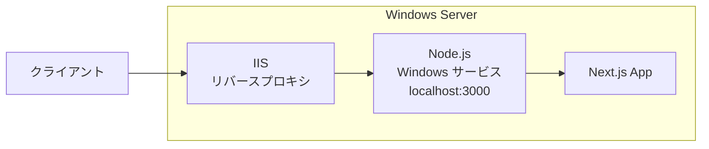
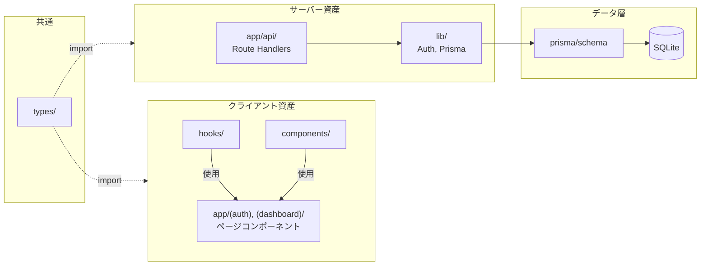
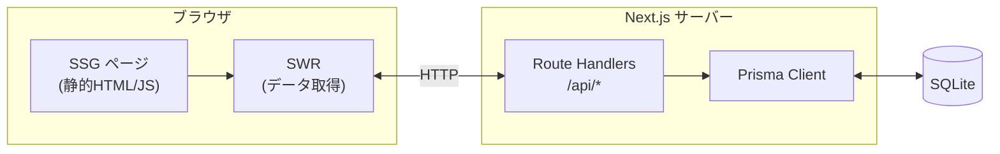
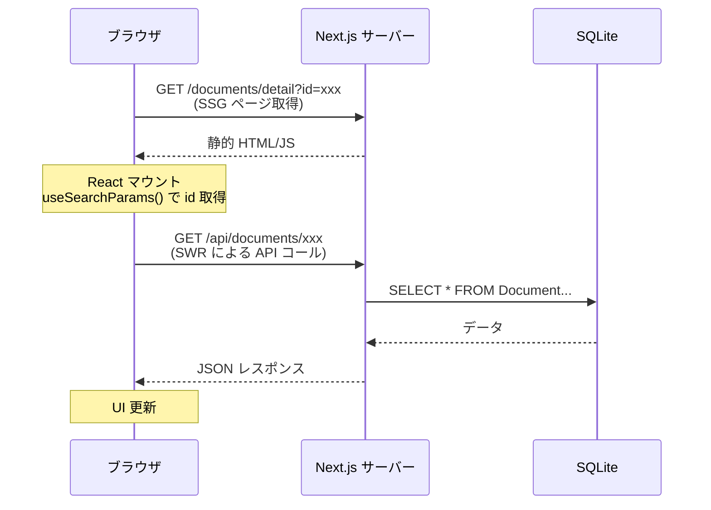
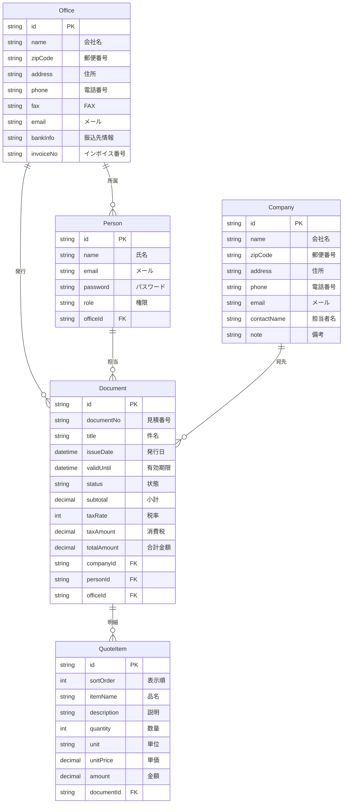
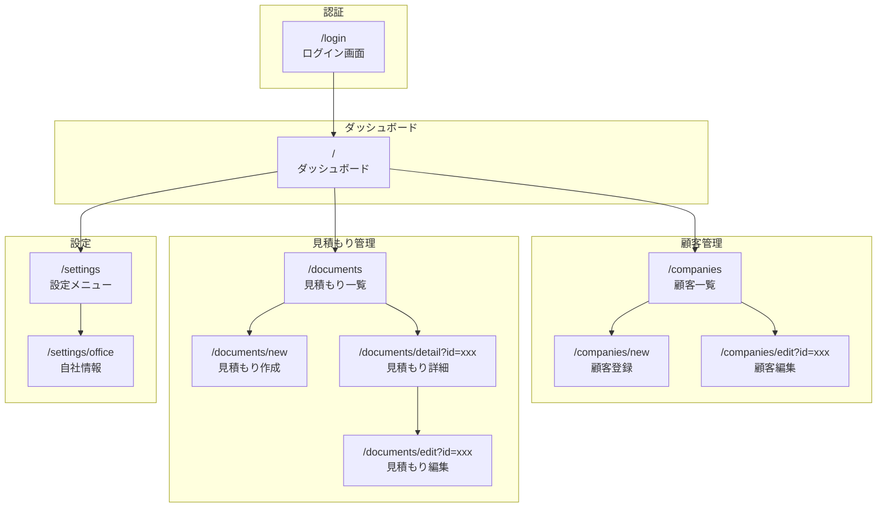
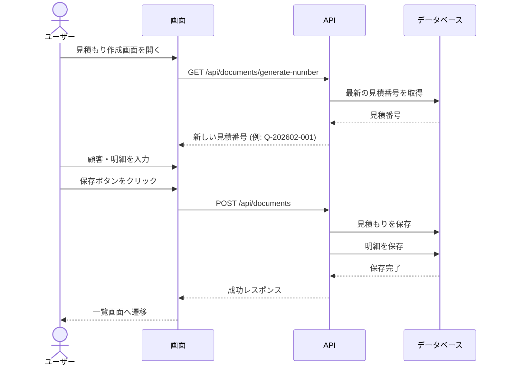

# 見積もり作成システム（サンプル）

Next.jsでAPIサーバー関連処理を同梱して構築された見積書作成・管理システムの**サンプルプロジェクト**です。

## 本プロジェクトについて

このプロジェクトは、以下の技術要素の動作確認・学習を目的としたサンプル実装です：

- **Next.js App Router** - SSG（Static Site Generation）によるページ生成
- **Route Handlers** - API エンドポイントの実装パターン
- **MUI v7** - Material UI を用いた UI コンポーネント設計
- **認証フロー** - JWT + Cookie によるセッション管理

### アーキテクチャ方針

- **ページは全て SSG（静的生成）** - `/api/*` 以外の動的ルート（`[id]`）は使用しない
- **データ取得はクライアントサイド** - SWR を使用して API からデータを取得
- **ID の受け渡しはクエリパラメータ** - `/documents/edit?id=xxx` 形式を採用

> **Note**: データベースには **SQLite + Prisma** を採用しています。これはローカル開発・動作確認を容易にするための選択のため、本番環境は想定されていません。

## 技術スタック

| カテゴリ | 技術 | 備考 |
|---------|------|------|
| フレームワーク | Next.js 16 (App Router) | SSG のみ（ページ） + Route Handlers（API） |
| UI | MUI v7 (Material UI) | |
| ORM | Prisma 7 | |
| データベース | SQLite | ※テスト用。本番は PostgreSQL/MySQL 推奨 |
| 認証 | JWT (jose) + bcryptjs | HttpOnly Cookie |
| データ取得 | SWR | クライアントサイドフェッチ |

## セットアップ

### 1. 依存関係のインストール

```bash
npm install
```

### 2. データベースのセットアップ

```bash
# マイグレーション実行
npm run db:migrate

# 初期データ投入（管理者ユーザー作成）
npm run db:seed
```

### 3. 開発サーバーの起動

```bash
npm run dev
```

http://localhost:3000 にアクセス

### 4. ログイン情報

初期管理者アカウント:

| 項目 | 値 |
|------|-----|
| メールアドレス | admin@example.com |
| パスワード | admin123 |

## IIS デプロイ

IIS をリバースプロキシとして使用し、Node.js をプロジェクトに同梱する方式です。
サーバーへの Node.js インストールは不要です。



### 必要条件

- Windows Server 2016 以降
- IIS 10.0 以降
- [URL Rewrite Module](https://www.iis.net/downloads/microsoft/url-rewrite)
- [Application Request Routing (ARR)](https://www.iis.net/downloads/microsoft/application-request-routing)

> **Note**: Node.js、NSSM はプロジェクトに同梱されるため、サーバーへのインストールは不要

### IIS モジュールのインストール（初回のみ）

デプロイ前に、以下の IIS モジュールを手動でインストールしてください。

1. **URL Rewrite Module** をダウンロード・インストール
   - https://www.iis.net/downloads/microsoft/url-rewrite

2. **Application Request Routing (ARR)** をダウンロード・インストール
   - https://www.iis.net/downloads/microsoft/application-request-routing

> **Note**: 両モジュールともインストーラ形式のため、ダウンロード後に実行するだけで完了します。ARR プロキシの有効化は `deploy.ps1` が自動で行います。

### デプロイ手順（推奨：サービス登録あり）

**`deploy.ps1` の処理内容:**
1. Node.js ポータブル版をダウンロード（未取得の場合）
2. NSSM（サービス化ツール）をダウンロード（`-InstallService` 時）
3. `npm run build` でプロダクションビルド
4. 必要なファイルをデプロイ先にコピー
5. `.env` ファイルを生成（JWT_SECRET 自動生成）
6. Windows サービスとして登録・起動（`-InstallService` 時）

```powershell
# デプロイ + Windows サービス登録（管理者として実行）
.\scripts\deploy.ps1
```

**3. IIS マネージャーでサイトを作成**

1. **IIS マネージャーを開く**
   - `Windows + R` → `inetmgr` と入力して Enter

2. **サイトを追加**
   - 左ペインの「サイト」を右クリック → 「Web サイトの追加」

3. **サイト設定を入力**
   | 項目 | 設定値 |
   |------|--------|
   | サイト名 | `QuoteSystem`（任意） |
   | 物理パス | `C:\inetpub\wwwroot\quote-system` |
   | バインドの種類 | `http` |
   | IP アドレス | `未使用の IP アドレスすべて` |
   | ポート | `80`（または任意のポート） |
   | ホスト名 | 空欄または `quote.example.com` など |

4. **OK をクリックしてサイト作成**

5. **動作確認**
   - ブラウザで `http://localhost/` または設定したホスト名にアクセス
   - ログイン画面が表示されれば成功

> **Tip**: ポート 80 が既に使用されている場合は、別のポート（例: 8080）を指定してください。

これで Node.js サーバーは Windows サービスとして自動管理されます：
- サーバー起動時に自動起動
- クラッシュ時に自動再起動
- Services.msc または `sc` コマンドで管理可能

### サービス管理コマンド

```powershell
# サービスの状態確認
sc query NextJsQuoteSystem

# サービス停止
sc stop NextJsQuoteSystem

# サービス開始
sc start NextJsQuoteSystem

# サービス削除（デプロイ先で実行）
.\scripts\uninstall-service.ps1
```

### 手動管理（サービス登録なし）

サービス化せずに手動で管理する場合：

```powershell
# デプロイ（サービス登録なし）
.\scripts\deploy.ps1 -TargetPath "C:\inetpub\wwwroot\quote-system"

# 手動起動
.\scripts\server-manager.ps1 start

# 手動停止
.\scripts\server-manager.ps1 stop
```

### 構成ファイル

| ファイル | 説明 |
|----------|------|
| `runtime/node/` | Node.js ポータブル版（同梱） |
| `runtime/nssm/` | NSSM サービス化ツール（同梱） |
| `runtime/logs/` | サーバーログ出力先 |
| `server.js` | Next.js サーバーエントリーポイント |
| `web.config` | IIS リバースプロキシ設定 |
| `scripts/install-service.ps1` | サービス登録スクリプト |
| `scripts/deploy.ps1` | デプロイ自動化スクリプト |

## ディレクトリ構成

```
.
├── src/
│   ├── app/                              # Next.js App Router（ルーティング）
│   │   ├── (auth)/                       # 認証グループ（未認証ユーザー向け）
│   │   │   ├── layout.tsx
│   │   │   └── login/page.tsx
│   │   │
│   │   ├── (dashboard)/                  # ダッシュボードグループ（認証必須）
│   │   │   ├── layout.tsx                # Sidebar + Header レイアウト
│   │   │   ├── page.tsx                  # ダッシュボード
│   │   │   ├── companies/                # 顧客管理
│   │   │   │   ├── page.tsx              # 一覧
│   │   │   │   ├── new/page.tsx          # 新規作成
│   │   │   │   └── edit/page.tsx         # 編集 (?id=xxx)
│   │   │   ├── documents/                # 見積もり管理
│   │   │   │   ├── page.tsx              # 一覧
│   │   │   │   ├── new/page.tsx          # 新規作成
│   │   │   │   ├── detail/page.tsx       # 詳細 (?id=xxx)
│   │   │   │   └── edit/page.tsx         # 編集 (?id=xxx)
│   │   │   └── settings/                 # 設定
│   │   │       ├── page.tsx
│   │   │       └── office/page.tsx
│   │   │
│   │   ├── api/                          # === バックエンド（API Routes） ===
│   │   │   ├── auth/
│   │   │   │   ├── login/route.ts        # POST: ログイン
│   │   │   │   ├── logout/route.ts       # POST: ログアウト
│   │   │   │   └── me/route.ts           # GET: 現在のユーザー
│   │   │   ├── companies/
│   │   │   │   ├── route.ts              # GET/POST
│   │   │   │   └── [id]/route.ts         # GET/PUT/DELETE
│   │   │   ├── documents/
│   │   │   │   ├── route.ts              # GET/POST
│   │   │   │   ├── [id]/route.ts         # GET/PUT/DELETE
│   │   │   │   └── generate-number/route.ts
│   │   │   └── offices/[id]/route.ts     # GET/PUT
│   │   │
│   │   ├── layout.tsx                    # ルートレイアウト
│   │   ├── providers.tsx                 # MUI ThemeProvider
│   │   └── globals.css
│   │
│   ├── components/                       # === フロントエンド（UIコンポーネント） ===
│   │   ├── ui/                           # 汎用UI
│   │   │   ├── ConfirmDialog.tsx         # 削除確認ダイアログ
│   │   │   └── LoadingSpinner.tsx        # ローディング表示
│   │   ├── layout/                       # レイアウト
│   │   │   ├── Header.tsx
│   │   │   └── Sidebar.tsx
│   │   └── features/                     # 機能別コンポーネント
│   │       ├── auth/
│   │       │   └── LoginForm.tsx
│   │       ├── companies/
│   │       │   └── CompanyForm.tsx
│   │       └── documents/
│   │           ├── DocumentForm.tsx
│   │           └── QuoteItemTable.tsx
│   │
│   ├── hooks/                            # === フロントエンド（カスタムフック） ===
│   │   ├── useAuth.ts                    # 認証状態管理
│   │   ├── useCompanies.ts               # 顧客データ取得
│   │   └── useDocuments.ts               # 見積もりデータ取得
│   │
│   ├── lib/                              # === バックエンド（サーバーサイド） ===
│   │   ├── db/
│   │   │   └── prisma.ts                 # Prismaクライアント
│   │   └── auth/
│   │       └── auth.ts                   # JWT、パスワードハッシュ、セッション
│   │
│   ├── types/                            # === 共通（型定義） ===
│   │   ├── index.ts                      # エクスポート
│   │   ├── api.ts                        # APIレスポンス型
│   │   ├── company.ts                    # 顧客型
│   │   ├── document.ts                   # 見積もり型
│   │   └── user.ts                       # ユーザー・自社情報型
│   │
│   ├── config/                           # 設定
│   │   └── theme.ts                      # MUIテーマ
│   │
│   ├── services/                         # ビジネスロジック（拡張用）
│   │
│   └── middleware.ts                     # 認証ミドルウェア
│
├── prisma/
│   ├── schema.prisma                     # DBスキーマ定義
│   ├── prisma.config.ts                  # Prisma設定
│   ├── seed.ts                           # 初期データ
│   └── dev.db                            # SQLiteファイル
│
├── scripts/                              # スクリプト
│   ├── setup.sh                          # 初期セットアップ (Mac/Linux)
│   ├── setup.bat                         # 初期セットアップ (Windows)
│   ├── setup-node.ps1                    # Node.js ポータブル版DL
│   ├── setup-nssm.ps1                    # NSSM DL
│   ├── install-service.ps1               # サービス登録
│   ├── uninstall-service.ps1             # サービス削除
│   ├── server-manager.ps1                # 手動サーバー管理
│   └── deploy.ps1                        # IISデプロイ
│
├── runtime/                              # ランタイム（デプロイ時生成）
│   ├── node/                             # Node.js ポータブル版
│   ├── nssm/                             # NSSM（サービス化ツール）
│   └── logs/                             # サーバーログ
│
├── server.js                             # Next.js サーバーエントリーポイント
├── web.config                            # IIS リバースプロキシ設定
└── package.json
```

### SSG + クエリパラメータ パターン

このプロジェクトでは、ページルートに動的セグメント（`[id]`）を使用せず、全てのページを静的生成（SSG）としています。

```
❌ /documents/[id]           → 動的ルート（SSR/ISR が必要）
✅ /documents/detail?id=xxx  → 静的ページ + クエリパラメータ（SSG）
```

**実装パターン:**

```tsx
"use client";
import { Suspense } from "react";
import { useSearchParams } from "next/navigation";

function DetailContent() {
  const searchParams = useSearchParams();
  const id = searchParams.get("id");
  // SWR で API からデータ取得
  const { data } = useDocument(id);
  // ...
}

export default function DetailPage() {
  return (
    <Suspense fallback={<LoadingSpinner />}>
      <DetailContent />
    </Suspense>
  );
}
```

> **Note**: `useSearchParams()` を使用するコンポーネントは `Suspense` でラップする必要があります。

### アーキテクチャ概要

**コードベース構成:**



**ランタイムフロー:**



**データ取得シーケンス:**



## 主要ファイルの説明

### バックエンド（サーバーサイド）

| ファイル | 説明 |
|----------|------|
| `src/lib/auth/auth.ts` | JWT生成・検証、パスワードハッシュ（bcrypt）、セッション管理 |
| `src/lib/db/prisma.ts` | Prismaクライアント（シングルトン） |
| `src/middleware.ts` | `/companies`, `/documents`, `/settings` へのアクセスを認証チェック |

### フロントエンド（クライアントサイド）

| ファイル | 説明 |
|----------|------|
| `src/hooks/useAuth.ts` | ログイン状態の取得、ログイン/ログアウト処理をSWRで管理 |
| `src/hooks/useCompanies.ts` | 顧客一覧取得、検索、ページネーション、CRUD関数 |
| `src/hooks/useDocuments.ts` | 見積もり一覧取得、見積番号生成、CRUD関数 |

### UI コンポーネント

| ファイル | 説明 |
|----------|------|
| `src/components/layout/Sidebar.tsx` | ナビゲーションメニュー |
| `src/components/layout/Header.tsx` | ページタイトル、ユーザーメニュー |
| `src/components/features/documents/QuoteItemTable.tsx` | 見積もり明細の行追加・削除・金額自動計算 |

### 型定義（共通）

| ファイル | 説明 |
|----------|------|
| `src/types/api.ts` | APIレスポンス、エラー型 |
| `src/types/company.ts` | 顧客企業の型 |
| `src/types/document.ts` | 見積もり、明細行の型 |
| `src/types/user.ts` | ユーザー、自社情報の型 |

### API エンドポイント

| エンドポイント | メソッド | 説明 |
|----------------|----------|------|
| `/api/auth/login` | POST | メール・パスワードで認証、JWTをCookieに設定 |
| `/api/auth/logout` | POST | Cookieを削除してログアウト |
| `/api/auth/me` | GET | 現在のログインユーザー情報を返す |
| `/api/companies` | GET/POST | 顧客一覧取得（検索・ページネーション対応）/ 新規作成 |
| `/api/companies/[id]` | GET/PUT/DELETE | 顧客詳細取得 / 更新 / 削除 |
| `/api/documents` | GET/POST | 見積もり一覧取得 / 新規作成（明細含む） |
| `/api/documents/[id]` | GET/PUT/DELETE | 見積もり詳細取得 / 更新 / 削除 |
| `/api/documents/generate-number` | GET | `Q-YYYYMM-NNN` 形式の見積番号を自動生成 |
| `/api/offices/[id]` | GET/PUT | 自社情報取得 / 更新 |

## スクリプト

### NPMスクリプト

| コマンド | 説明 |
|----------|------|
| `npm run dev` | 開発サーバー起動 |
| `npm run build` | プロダクションビルド |
| `npm run start` | プロダクションサーバー起動 |
| `npm run db:migrate` | DBマイグレーション |
| `npm run db:seed` | 初期データ投入 |
| `npm run db:studio` | Prisma Studio起動 |

### シェルスクリプト

| スクリプト | 説明 |
|------------|------|
| `scripts/setup.sh` | Mac/Linux 初期セットアップ |
| `scripts/setup.bat` | Windows 初期セットアップ |
| `scripts/setup-node.ps1` | Node.js ポータブル版ダウンロード |
| `scripts/setup-nssm.ps1` | NSSM（サービス化ツール）ダウンロード |
| `scripts/install-service.ps1` | Windows サービスとして登録 |
| `scripts/uninstall-service.ps1` | Windows サービスを削除 |
| `scripts/server-manager.ps1` | Node.js サーバー手動管理 |
| `scripts/deploy.ps1` | IIS デプロイ（Node.js + NSSM 同梱） |

## 機能一覧

- **認証機能**: ユーザー名/パスワードによるログイン
- **ダッシュボード**: 顧客数・見積もり数の統計表示
- **顧客管理**: 顧客企業のCRUD操作
- **見積もり管理**: 見積書の作成・編集・一覧表示
- **自社情報設定**: 会社名・住所・振込先情報の管理
- **印刷対応**: 見積書の印刷用スタイル

## データモデル



## 画面構成



## 見積もり作成フロー


