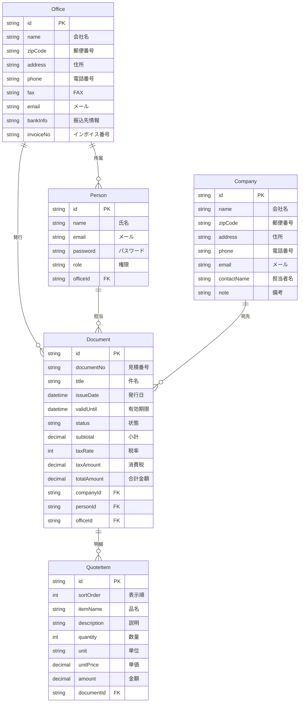
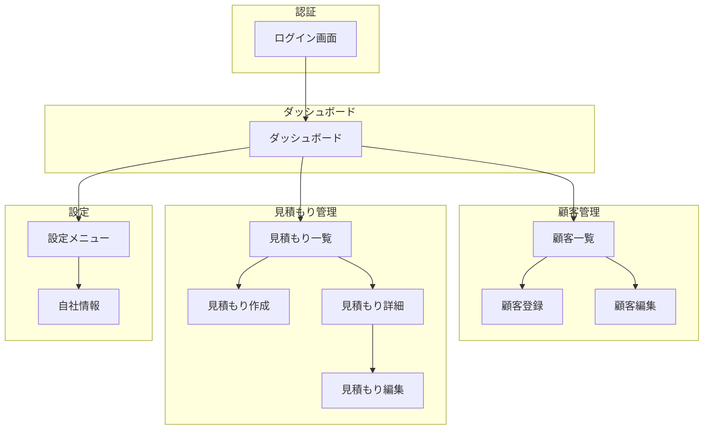
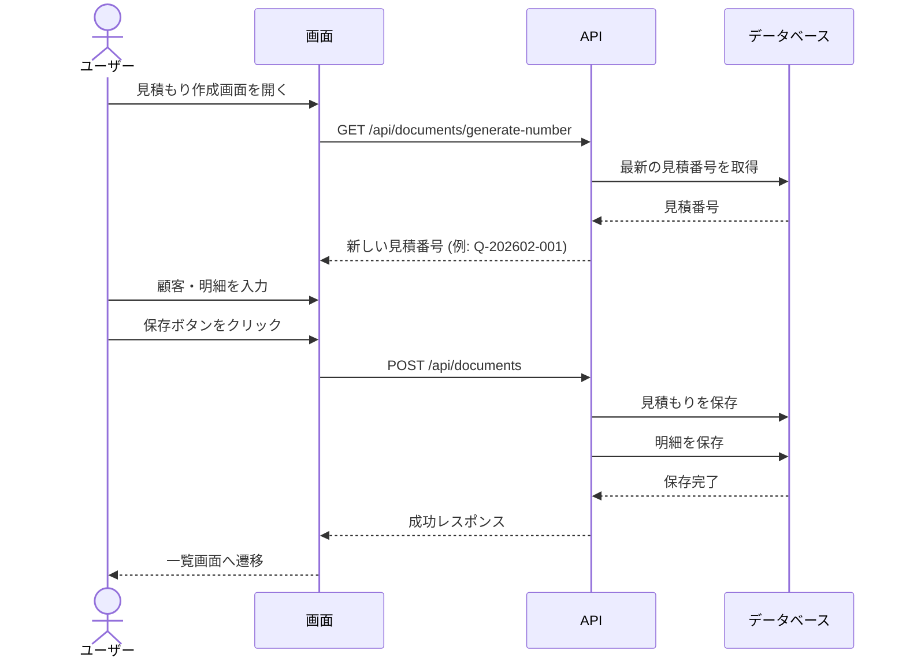

# 見積もり作成システム

Next.js 16 + MUI + Prisma で構築された見積書作成・管理システムです。

## 機能一覧

- **認証機能**: ユーザー名/パスワードによるログイン
- **ダッシュボード**: 顧客数・見積もり数の統計表示
- **顧客管理**: 顧客企業のCRUD操作
- **見積もり管理**: 見積書の作成・編集・一覧表示
- **自社情報設定**: 会社名・住所・振込先情報の管理
- **印刷対応**: 見積書の印刷用スタイル

## 技術スタック

| カテゴリ | 技術 |
|---------|------|
| フレームワーク | Next.js 16 (App Router) |
| UI | MUI v7 (Material UI) |
| ORM | Prisma 7 |
| データベース | SQLite |
| 認証 | JWT (jose) + bcryptjs |
| データ取得 | SWR |

## データモデル



## 画面構成



## 見積もり作成フロー



## セットアップ

### 1. 依存関係のインストール

```bash
npm install
```

### 2. データベースのセットアップ

```bash
# マイグレーション実行
npm run db:migrate

# 初期データ投入（管理者ユーザー作成）
npm run db:seed
```

### 3. 開発サーバーの起動

```bash
npm run dev
```

http://localhost:3000 にアクセス

## ログイン情報

初期管理者アカウント:

| 項目 | 値 |
|------|-----|
| メールアドレス | admin@example.com |
| パスワード | admin123 |

## ディレクトリ構成

```
.
├── app/                              # Next.js App Router
│   ├── (auth)/                       # 認証グループ（未認証ユーザー向け）
│   │   ├── layout.tsx                # 認証レイアウト
│   │   └── login/
│   │       └── page.tsx              # ログイン画面
│   │
│   ├── (dashboard)/                  # ダッシュボードグループ（認証必須）
│   │   ├── layout.tsx                # Sidebar + Header レイアウト
│   │   ├── page.tsx                  # ダッシュボード（統計表示）
│   │   │
│   │   ├── companies/                # 顧客管理
│   │   │   ├── page.tsx              # 顧客一覧
│   │   │   ├── new/page.tsx          # 顧客登録
│   │   │   └── [id]/edit/page.tsx    # 顧客編集
│   │   │
│   │   ├── documents/                # 見積もり管理
│   │   │   ├── page.tsx              # 見積もり一覧
│   │   │   ├── new/page.tsx          # 見積もり作成
│   │   │   └── [id]/
│   │   │       ├── page.tsx          # 見積もり詳細
│   │   │       └── edit/page.tsx     # 見積もり編集
│   │   │
│   │   └── settings/                 # 設定
│   │       ├── page.tsx              # 設定メニュー
│   │       └── office/page.tsx       # 自社情報編集
│   │
│   ├── api/                          # API Routes (Route Handlers)
│   │   ├── auth/
│   │   │   ├── login/route.ts        # POST: ログイン認証
│   │   │   ├── logout/route.ts       # POST: ログアウト
│   │   │   └── me/route.ts           # GET: 現在のユーザー情報
│   │   │
│   │   ├── companies/
│   │   │   ├── route.ts              # GET: 一覧, POST: 作成
│   │   │   └── [id]/route.ts         # GET/PUT/DELETE: 個別操作
│   │   │
│   │   ├── documents/
│   │   │   ├── route.ts              # GET: 一覧, POST: 作成
│   │   │   ├── [id]/route.ts         # GET/PUT/DELETE: 個別操作
│   │   │   └── generate-number/route.ts  # GET: 見積番号自動生成
│   │   │
│   │   └── offices/
│   │       └── [id]/route.ts         # GET/PUT: 自社情報
│   │
│   ├── layout.tsx                    # ルートレイアウト（Providers適用）
│   ├── providers.tsx                 # MUI ThemeProvider, CssBaseline
│   └── globals.css                   # グローバルCSS
│
├── components/                       # Reactコンポーネント
│   ├── auth/
│   │   └── LoginForm.tsx             # ログインフォーム
│   │
│   ├── common/
│   │   ├── ConfirmDialog.tsx         # 削除確認ダイアログ
│   │   └── LoadingSpinner.tsx        # ローディング表示
│   │
│   ├── companies/
│   │   └── CompanyForm.tsx           # 顧客登録/編集フォーム
│   │
│   ├── documents/
│   │   ├── DocumentForm.tsx          # 見積もり作成/編集フォーム
│   │   └── QuoteItemTable.tsx        # 明細行テーブル（追加/削除/編集）
│   │
│   └── layout/
│       ├── Header.tsx                # ヘッダー（タイトル、ユーザーメニュー）
│       └── Sidebar.tsx               # サイドバー（ナビゲーション）
│
├── hooks/                            # カスタムフック（SWRベース）
│   ├── useAuth.ts                    # 認証状態管理、ログイン/ログアウト
│   ├── useCompanies.ts               # 顧客データ取得、CRUD操作
│   └── useDocuments.ts               # 見積もりデータ取得、CRUD操作
│
├── lib/                              # ユーティリティ関数
│   ├── auth.ts                       # JWT検証、パスワードハッシュ、セッション管理
│   └── prisma.ts                     # Prismaクライアント（シングルトン）
│
├── prisma/
│   ├── schema.prisma                 # データベーススキーマ定義
│   ├── seed.ts                       # 初期データ投入スクリプト
│   └── dev.db                        # SQLiteデータベースファイル
│
├── theme.ts                          # MUIテーマ設定
├── middleware.ts                     # 認証ミドルウェア（保護ルート）
├── prisma.config.ts                  # Prisma設定（SQLite接続）
└── package.json
```

## 主要ファイルの説明

### 認証関連

| ファイル | 説明 |
|----------|------|
| `lib/auth.ts` | JWT生成・検証、パスワードハッシュ（bcrypt）、Cookieセッション管理 |
| `middleware.ts` | `/companies`, `/documents`, `/settings` へのアクセスを認証チェック |
| `hooks/useAuth.ts` | ログイン状態の取得、ログイン/ログアウト処理をSWRで管理 |

### データ取得

| ファイル | 説明 |
|----------|------|
| `hooks/useCompanies.ts` | 顧客一覧取得、検索、ページネーション、CRUD関数をエクスポート |
| `hooks/useDocuments.ts` | 見積もり一覧取得、見積番号生成、CRUD関数をエクスポート |

### UI コンポーネント

| ファイル | 説明 |
|----------|------|
| `components/layout/Sidebar.tsx` | ナビゲーションメニュー（顧客管理、見積もり、設定） |
| `components/layout/Header.tsx` | ページタイトル表示、ユーザー名、ログアウトボタン |
| `components/documents/QuoteItemTable.tsx` | 見積もり明細の行追加・削除・金額自動計算 |

### API エンドポイント

| エンドポイント | メソッド | 説明 |
|----------------|----------|------|
| `/api/auth/login` | POST | メール・パスワードで認証、JWTをCookieに設定 |
| `/api/auth/logout` | POST | Cookieを削除してログアウト |
| `/api/auth/me` | GET | 現在のログインユーザー情報を返す |
| `/api/companies` | GET/POST | 顧客一覧取得（検索・ページネーション対応）/ 新規作成 |
| `/api/companies/[id]` | GET/PUT/DELETE | 顧客詳細取得 / 更新 / 削除 |
| `/api/documents` | GET/POST | 見積もり一覧取得 / 新規作成（明細含む） |
| `/api/documents/[id]` | GET/PUT/DELETE | 見積もり詳細取得 / 更新 / 削除 |
| `/api/documents/generate-number` | GET | `Q-YYYYMM-NNN` 形式の見積番号を自動生成 |
| `/api/offices/[id]` | GET/PUT | 自社情報取得 / 更新 |

## NPMスクリプト

| コマンド | 説明 |
|----------|------|
| `npm run dev` | 開発サーバー起動 |
| `npm run build` | プロダクションビルド |
| `npm run start` | プロダクションサーバー起動 |
| `npm run db:migrate` | DBマイグレーション |
| `npm run db:seed` | 初期データ投入 |
| `npm run db:studio` | Prisma Studio起動 |

## IIS デプロイ

### 必要条件

- Windows Server 2016以降
- IIS 10.0以降
- Node.js (LTS)
- [iisnode](https://github.com/Azure/iisnode/releases)
- [URL Rewrite Module](https://www.iis.net/downloads/microsoft/url-rewrite)

### デプロイ手順

```powershell
# 1. ビルド
npm run build

# 2. デプロイスクリプト実行
.\deploy.ps1 -TargetPath "C:\inetpub\wwwroot\quote-system"

# 3. IIS マネージャーで設定
#    - アプリケーションプール: マネージコードなし
#    - 物理パス: C:\inetpub\wwwroot\quote-system
```

### 構成ファイル

| ファイル | 説明 |
|----------|------|
| `server.js` | Node.js エントリーポイント |
| `web.config` | IIS + iisnode 設定 |
| `deploy.ps1` | デプロイ自動化スクリプト |

## ライセンス

MIT
